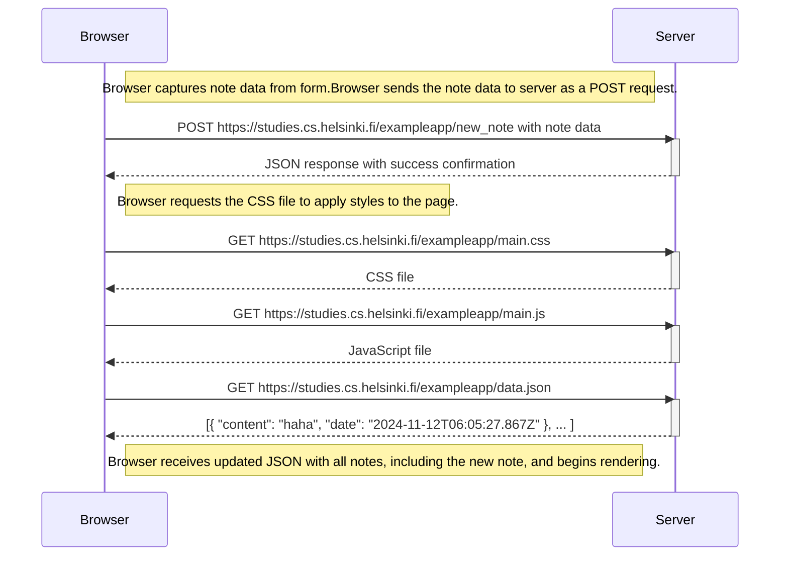

```mermaid
sequenceDiagram
    participant Browser
    participant Server

    Note right of Browser: Browser captures note data from form.Browser sends the note data to server as a POST request.
    Browser->>Server: POST https://studies.cs.helsinki.fi/exampleapp/new_note with note data
    activate Server
    Server-->>Browser: JSON response with success confirmation
    deactivate Server

    Note right of Browser: Browser requests the CSS file to apply styles to the page.
    Browser->>Server: GET https://studies.cs.helsinki.fi/exampleapp/main.css
    activate Server
    Server-->>Browser: CSS file
    deactivate Server

    Browser->>Server: GET https://studies.cs.helsinki.fi/exampleapp/main.js
    activate Server
    Server-->>Browser: JavaScript file
    deactivate Server

    Browser->>Server: GET https://studies.cs.helsinki.fi/exampleapp/data.json
    activate Server
    Server-->>Browser: [{  "content": "haha", "date": "2024-11-12T06:05:27.867Z" }, ... ]
    deactivate Server
    Note right of Browser: Browser receives updated JSON with all notes, including the new note, and begins rendering.
```