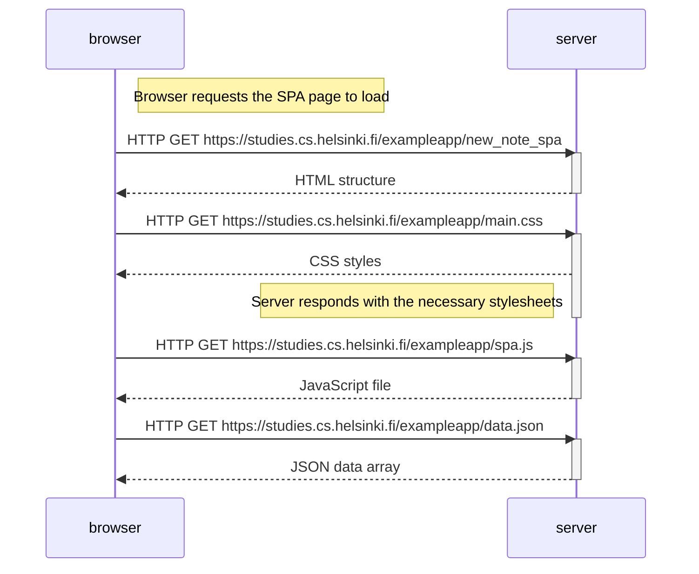

```mermaid
sequenceDiagram
    participant browser
    participant server
    
    Note right of browser: Browser requests the SPA page to load 
    browser->>server: HTTP GET https://studies.cs.helsinki.fi/exampleapp/new_note_spa
    activate server
    server-->>browser: HTML structure
    deactivate server

    browser->>server: HTTP GET https://studies.cs.helsinki.fi/exampleapp/main.css
    activate server
    server-->>browser: CSS styles
    Note left of server: Server responds with the necessary stylesheets
    deactivate server

    browser->>server: HTTP GET https://studies.cs.helsinki.fi/exampleapp/spa.js
    activate server
    server-->>browser: JavaScript file
    deactivate server

    browser->>server: HTTP GET https://studies.cs.helsinki.fi/exampleapp/data.json
    activate server
    server-->>browser: JSON data array
    deactivate server

```