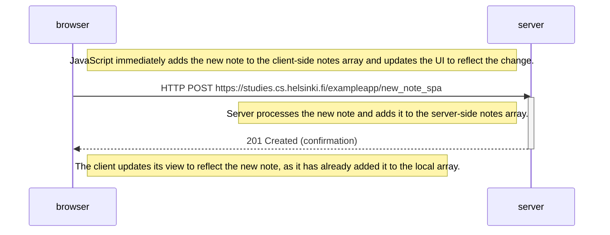

```mermaid
sequenceDiagram
    participant browser
    participant server

    Note right of browser: JavaScript immediately adds the new note to the client-side notes array and updates the UI to reflect the change.

    browser->>server: HTTP POST https://studies.cs.helsinki.fi/exampleapp/new_note_spa
    activate server

    Note left of server: Server processes the new note and adds it to the server-side notes array.
    server-->>browser: 201 Created (confirmation)
    deactivate server

    Note right of browser: The client updates its view to reflect the new note, as it has already added it to the local array.


```